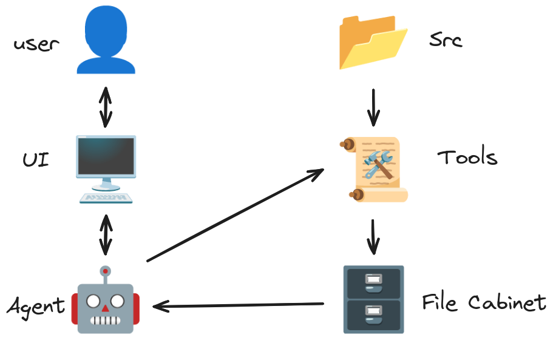
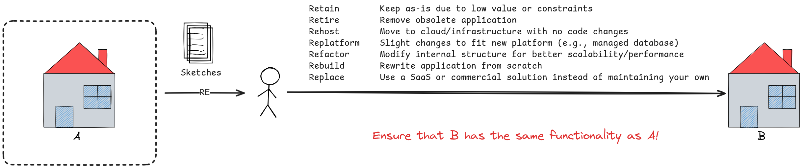

## 🔍 Static Analysis Capabilities

  

Unlock key insights into your codebase with advanced static analysis techniques:

### ✅ 1. Syntax Analysis

* Validates that source code conforms to the grammar rules of its language.
* Detects syntax errors early in the development or migration process.

### 🔄 2. Flowchart Generation

* Generates visual diagrams from code to illustrate control flow.
* Simplifies understanding of legacy code logic and decision paths.

### 🔁 3. Control Flow Analysis

* Analyzes the sequence of program instructions.
* Supports debugging, performance tuning, and behavior analysis.

### 📈 4. Data Flow Analysis

* Tracks the lifecycle of data (definition, use, modification).
* Helps detect:

  * Unused variables
  * Dead code
  * Potential runtime issues

### 📦 5. Data Structure Analysis

* Evaluates the usage and efficiency of data structures.
* Aids in refactoring, modernization, and performance optimization.

### 🔗 6. Data Dependency Analysis

* Maps out dependencies between data elements and variables.
* Useful for:

  * Code impact analysis
  * Improving modularity
  * Refactoring legacy logic

---

## 🧠 Reverse Engineering

Easily convert legacy or poorly documented code into comprehensible formats using reverse engineering tools:

  

### Key Deliverables:

* **Flowcharts** to visualize logic and control paths.
* **Abstract models** to represent control/data dependencies.
* **Parsed structures** for easier migration and refactoring.

Ideal for:

* Understanding legacy COBOL or mainframe code
* Supporting modernization to modern architectures
* Enhancing documentation and onboarding

---

## 📚 Resources & Further Reading

Expand your knowledge with these helpful guides and tools:

### 🖥️ Mainframe & COBOL

* [IBM z/OS Basic Skills](https://www.ibm.com/docs/en/zos-basic-skills)
* [Mainframes Tech Help](https://www.mainframestechhelp.com/)
* [IBM Mainframer Portal](https://www.ibmmainframer.com/#)
* [IBM Z Open Editor](https://ibm.github.io/zopeneditor-about/)
* [GnuCOBOL Project](https://gnucobol.sourceforge.io/)
* [Learn COBOL in Y Minutes](https://learnxinyminutes.com/cobol/)

### 🔧 Tools & Community

* [Codefori Documentation](https://codefori.github.io/docs/)
* [Zowe: Modern Mainframe Framework](https://www.zowe.org/)
* [Sourcegraph: Universal Code Search](https://sourcegraph.com/)
* [code2flow (Flowchart Generator)](https://github.com/scottrogowski/code2flow)
