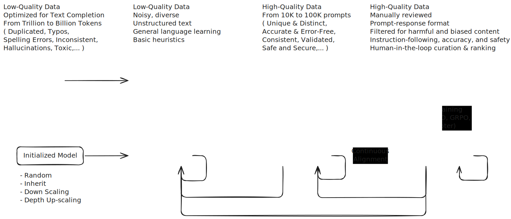

### Example of the model's family

<div align="center">
  
</div>

Other well-known LLM models include GPT, Llama, DeepSeek, Qwen, Mistral, SmolLM2, Gemma, etc.

### Training pipeline

<div align="center">
  
</div>

### Comparison of LLM Training & Adaptation Methods

| **Method**        | **Usage, Use Case** | **Cost** | **GPU Consumption** <br> _(A100 / H100)_ | **Power Consumption** | **Data Quality** | **Data Quantity** <br> _(Tokens)_ | **Deployment Complexity** | **Time Consumption** |
|-------------------|--------------------|----------|----------------------|------------------------|------------------|-----------------|------------------------|----------------------|
| **Pretraining**   | Training a foundational LLM from scratch. Needed for new architectures or massive customization. | $$$$$ (very high) | **800+ GB** <br> _(TPU clusters, 1024x A100)_ | **Extremely high** (datacenter level) | **Moderate** (garbage data ruins training) | **Trillions** | **Very high** (infrastructure, distributed serving, parallelism) | **Very long** (months) |
| **SFT (Supervised Fine-Tuning)** | Adapts a base model to specific tasks/domains via labeled datasets. Used for chatbot tuning, medical AI, finance, etc. | $$$ (high) | **40-80 GB** <br> _(4x A100, 2x H100)_ | **High** (multi-GPU training) | **High** (task-specific annotations) | **Millions to billions** | **Moderate** (model checkpoint needs integration & hosting) | **Medium to long** (days/weeks) |
| **Aligned Training (PPO, DPO, GRPO, ORPO)** | Reinforcement learning (RLHF, DPO, etc.) to align AI responses with human feedback. Used for safety tuning, helpfulness, etc. | $$$ (high) | **40-100 GB** <br> _(8x A100, 4x H100)_ | **High** (RL-based training is expensive) | **Requires highly curated human-labeled data** | **Millions to billions** | **High** (RL pipelines are complex, inference needs reward models) | **Long** (weeks) |
| **PEFT - LoRA** | Injects trainable low-rank matrices for domain adaptation. Keeps most model weights frozen. | $ (low) | **16-40 GB** <br> _(1-2x A100)_ | **Low** (efficient training) | **Moderate to high** | **Millions** | **Low** (adapts to existing models easily) | **Short** (hours to days) |
| **PEFT - QLoRA** | A memory-efficient LoRA that quantizes model weights to save VRAM. | $ (very low) | **8-24 GB** <br> _(1x A100, consumer GPUs possible)_ | **Very low** | **Moderate** | **Millions** | **Low** | **Very short** (hours) |
| **PEFT - Prompt Tuning** | Uses learnable soft prompts to tune models without modifying weights. | $ (very low) | **8-16 GB** <br> _(1x A100, RTX 3090 possible)_ | **Very low** | **Moderate** | **Thousands to millions** | **Very low** (just loading a new prompt prefix) | **Very short** (minutes to hours) |
| **RAG (Retrieval-Augmented Generation)** | Uses external retrieval systems to inject real-time knowledge instead of fine-tuning. Reduces hallucination. | $$ (moderate) | **16-32 GB** <br> _(1-2x A100)_ | **Moderate** (depends on retrieval system) | **Depends on external knowledge base** | **Millions (training) + External retrieval** | **High** (requires embeddings, vector DB, retrieval system) | **Short** (setup time mostly) |
| **MoE (Mixture of Experts)** | Model selects only a subset of multiple expert networks per query, saving compute. Used in very large-scale LLMs. | $$$$ (high) | **100+ GB** <br> _(32+ A100s, or custom TPU setups)_ | **High** | **Must be diverse to train effective experts** | **Billions to trillions** | **Very high** (managing expert selection, routing logic, parallelism) | **Long** (requires routing & expert selection tuning) |

---

### **Key Takeaways**
1. **Pretraining** is by far the most expensive and compute-intensive, requiring trillions of tokens and top-tier hardware.  
2. **SFT** is a balanced approach for task-specific tuning but still demands high-quality data and multiple GPUs.  
3. **Alignment training** (PPO, DPO, etc.) is costly but crucial for models like ChatGPT to align with human preferences.  
4. **LoRA & QLoRA** are cost-effective ways to adapt LLMs, requiring minimal compute and time.  
5. **Prompt tuning** is the easiest and cheapest way to modify behavior without training.  
6. **RAG** is ideal for dynamic knowledge injection but adds system complexity.  
7. **MoE** is useful for scaling large models efficiently but requires complex inference pipelines.

**Note**: Reinforcement Fine-tuning (RFT) can work will in situations where...
1. **You have no labeled data...** but you can *verify* the correctness of the output (e.g transpiling source code).
2. **You have limited labeled data...** but not enough for SFT (i.e generally less then 1000 labeled examples).
3. **Chain-of-thought reasoning improves performance** Task performance improves significantly when you apply chain-of-thought reasoning.

Tasks suited for RFT
- Mathematical Problem Solving
- Code Generation and Debugging
- Logical and Multi-Step Reasoning

```
                   When should you choose RFT over SFT?

                     ┌───────────────────────────────┐
                     │ Do you have labeled (ground   │
                     │ truth) data?                  │
                     └──────────────┬────────────────┘
                                    │
               ┌────────────────────┴───────────────────┐
               │                                        │
              No                                       Yes
               │                                        │
     ┌─────────▼─────────┐                 ┌────────────▼───────────┐
     │ Is the task       │────┐            │        How much?       │
     │ "verifiable"?     │    │            └────────────┬───────────┘
     └─────────┬─────────┘    │                         │
               │              │                         │
               │No            │Yes       ┌──────────────▼───────────────┐
               │              │          │ < 100k examples (even <100)  │───No───┐
               │              │          └──────────────┬───────────────┘        │
               │              │                         │Yes                     │
               │              │            ┌────────────▼─────────────┐          │ 
               │              │            │ Does CoT / reasoning     │─────No───┐
               │              │            │ help?                    │          │
               |              │            └────────────┬─────────────┘          │
               |              │                         │Yes                     │
               |              └─────────────────────────│                        │
            ┌──▼──┐                                  ┌──▼──┐                  ┌──▼──┐
            │RLHF │                                  │ RFT │                  │ SFT │
            └─────┘                                  └─────┘                  └─────┘
```

### LLM Tools and Frameworks

1. [agent](./Agents-Course)
2. [quantization](./Quantization)
3. [langgraph](./langgraph)
4. [llamaindex](./llamaindex)
5. [llamacpp](./llamacpp)
6. [ollama](./ollama)
7. [vllm](./vllm)
8. [lighteval](./lighteval)
9. [distilabel](./distilabel)
10. [TGI](./TGI)
11. [autogen](https://microsoft.github.io/autogen/0.2/docs/Getting-Started/)

### References

- [SmolLM](https://huggingface.co/collections/HuggingFaceTB/smollm-6695016cad7167254ce15966)
- [SmolLM2](https://huggingface.co/collections/HuggingFaceTB/smollm2-6723884218bcda64b34d7db9)
